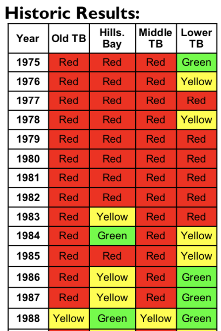

Original: [esherwoo77/pull_epc_data:pull_epc_data.Rmd](https://github.com/esherwoo77/pull_epc_data/blob/master/pull_epc_data.Rmd)

```{r setup, include=FALSE}
# libraries
require(tidyverse)
require(lubridate)
require(readxl)
require(curl)
require(leaflet)
require(rmarkdown)
require(here) # gets consistent path based on *.Rproj
require(glue) # easy string creation
library(tools)
library(gt)
#library(tbeptools)
devtools::load_all('../tbeptools/.')
knitr::opts_chunk$set(echo = TRUE, message = F, warning = F)

# variables
download_latest_epchc <- FALSE

# paths
# here(): set path based on root of repo where *.Rproj is found
epchc_xlsx    <- here("data-raw/epchc.xlsx")
epcdata_rdata <- here("data-raw/epcdata.RData")

# set Google Drive folder to where sync'd
user <- Sys.info()[["user"]]
dir_gdrive <- case_when(
  user == "Marcus" ~ "C:/Users/Marcus.SCCWRP2K/Google Drive/tbep-tech",
  user == "bbest" ~ "/Users/bbest/Gdrive Ecoquants/projects/tbep-tech")

# test paths
test_xlsx <- file.path(dir_gdrive, "data/wq/2018_Results_Updated.xls")
stopifnot(file.exists(test_xlsx))
```

## TODO

- Shiny app:
  - slider to change thresholds and see results

## Code to Download EPCHC Dataset
```{r epchc_download}
#library(tbeptools)
#get_epchc_wq(epchc_xlsx)

#URL of EPCHC's long-term dataset in Excel Spreadsheet format
epchc_url <- "ftp://ftp.epchc.org/EPC_ERM_FTP/WQM_Reports/RWMDataSpreadsheet_ThroughCurrentReportMonth.xlsx"

if (!file.exists(epchc_xlsx) | download_latest_epchc){
  # download data from EPCHC's ftp site
  tmp_xlsx <- tempfile(fileext = "xlsx")
  download.file(url = epchc_url, destfile = tmp_xlsx, method = "libcurl", mode = "wb") # 23.2 MB
  
  is_latest <- md5sum(epchc_xlsx) == md5sum(tmp_xlsx)
  if (!is_latest){
    file.copy(tmp_xlsx, epchc_xlsx, overwrite=T)
  }
}

# TODO: for Travis updating: if (is_latest) return() # no need to update
```

## Download and import EPCHC dataset

```{r epchc_import}
# load data and some light formatting
epcdata <- load_epchc_wq(test_xlsx, download_latest_epchc = F) 
```


```{r ecphc_validate}
#Display station locations
wqsites <- frmdat(epcdata) %>% 
           select(epchc_station, Latitude, Longitude) %>% 
           unique()                                                   

map <- leaflet(wqsites) %>%                                         
              addProviderTiles(providers$CartoDB.Positron) %>% 
              addCircleMarkers(~Longitude, ~Latitude,
                               radius = 6,
                               color = 'black',
                               stroke = FALSE,
                               opacity = 0.8,
                               popup = ~as.character(paste('EPC Station:', epchc_station)), 
                               group = 'Water quality') %>% 
              addLayersControl(overlayGroups = c('Water quality'),
                               options = layersControlOptions(collapsed = FALSE))
map
```

## Plot Mean Annual Chl-a Values by Bay Segment {.tabset}
```{r plot_chla_annual_averages, results='asis'}
aves <- avedat(epcdata)

chladata <- aves$ann %>% 
  filter(grepl('chla', var)) %>% 
  spread(var, val)
  
bay_segments <- unique(stations$bay_segment)
cols <- c("Annual Mean"="red", "Management Target"="blue", "Regulatory Threshold"="blue", "Small Mag. Exceedance"="blue", "Large Mag. Exceedance"="blue")
for (i in seq_along(bay_segments)) {
   chlaplot <- chladata %>%
                 filter(bay_segment == bay_segments[i] & yr<2019) %>%                           ###   LOOP TO PLOT BY BAYSEGMENT
                 ggplot(aes(x=yr)) +                                                            ###   SEE GARY'S NOTES ON REQUESTED IMPROVEMENTS
                   geom_point(aes(y=mean_chla, colour="Annual Mean"), size=3) +
                   geom_line(aes(y=mean_chla, colour="Annual Mean"), size=0.75) +
                   geom_hline(data=targets, aes(yintercept = as.numeric(chla_thresh[i]),        ###    DO THEY WANT TO ADD OTHER REFERENCE LINES?
                                                colour="Regulatory Threshold")) +
                   ggtitle(paste(targets$name[i])) +
                   geom_text(data=targets, parse = TRUE,
                             aes(1973, as.numeric(chla_thresh[i]),
                                 label = paste(chla_thresh[i],"~ mu * g%.%L^{-1}"),            ### NOT SURE WHAT g%.%L IS BUT ITS A LABEL
                                 hjust = 0.2, vjust = -0.3)) +
                   ylab(expression("Mean Annual Chlorophyll-a ("~ mu * "g\u00B7L"^-1 *")")) +
                   xlab("") +
                   scale_x_continuous(breaks=seq(1973,2019,by=1),                                   ### IS THERE A WAY TO AUTOMATE THIS SO WE DONT HAVE TO MANUALLY SCALE AXIS?
                                      labels=c(1973, rep("",3), 1977, rep("",3), 1981, rep("",3),
                                               1985, rep("",3), 1989, rep("",3), 1993, rep("",3),
                                               1997, rep("",3), 2001, rep("",3), 2005, rep("",3),
                                               2009, rep("",3), 2013, rep("",3), 2017, rep("",2)),
                                      expand = c(0.035,0)) +
                   theme(plot.title = element_text(hjust = 0.5),
                         panel.grid.minor=element_blank(),
                         panel.grid.major=element_blank(),
                         legend.position = c(0.88, 0.95),
                         legend.background = element_rect(fill=NA)) +
                   scale_colour_manual(name="", values = cols,
                                       labels=c("Annual Mean", "Regulatory Threshold"))
   cat("###", paste(targets$name[i]), "\n")
   print(chlaplot)
   cat("\n\n")
} 
```

## Plot Mean Annual Light Attenuation Values by Bay Segment {.tabset}
```{r plot_la_annual_averages, results='asis'}
sdmdata <- aves$ann %>% 
  filter(grepl('\\_sdm$|\\_la$', var)) %>% 
  spread(var, val)

for (i in seq_along(bay_segments)) {
    sdmplot <- sdmdata %>%
                 filter(bay_segment == bay_segments[i] & yr<2019) %>% 
                 ggplot(aes(x=yr)) + 
                   geom_point(aes(y=mean_la, colour="Annual Mean"), size=3) +
                   geom_line(aes(y=mean_la, colour="Annual Mean"), size=0.75) +
                   geom_hline(data=targets, aes(yintercept = as.numeric(la_target[i]),
                                                colour="Management Target")) +
                   ggtitle(paste(targets$name[i])) +
                   geom_text(data=targets, parse = T,
                             aes(1973, as.numeric(la_target[i]),
                                 label = paste(la_target[i],"~m","^{-1}"),
                                 hjust = 0.3, vjust = -0.3)) +
                   ylab(expression("Mean Annual Light Attenuation (m  " ^-1 *")")) +
                   xlab("") +
                   scale_x_continuous(breaks=seq(1973,2019,by=1),
                                      labels=c(1973, rep("",3), 1977, rep("",3), 1981, rep("",3),
                                               1985, rep("",3), 1989, rep("",3), 1993, rep("",3),
                                               1997, rep("",3), 2001, rep("",3), 2005, rep("",3),
                                               2009, rep("",3), 2013, rep("",3), 2017, rep("",2)),
                                      expand = c(0.035,0)) +
                   theme(plot.title = element_text(hjust = 0.5),
                         panel.grid.minor=element_blank(),
                         panel.grid.major=element_blank(),
                         legend.position = c(0.88, 0.95),
                         legend.background = element_rect(fill=NA)) +
                   scale_colour_manual(name="", values = cols,
                                       labels=c("Annual Mean", "Management Target"))
   cat("###", paste(targets$name[i]), "\n")  
   print(sdmplot)
   cat("\n\n")
} 

```
#### NEED TO USE THE FILES BELOW TO GENERATE THE COLOR CODED TABLE OF RESULTS

## Export Annual Values as a Tidy CSV File
Export final datasets to csv files in 'data-processed' folder.
```{r epchc_export_tidy_data}
# write.csv(chladata, file = "./data-processed/TB_Chla_Annual_Means.csv")
# write.csv(chlamodata, file = "./data-processed/TB_Chla_Monthly_means.csv")
# write.csv(sdmdata, file = "./data-processed/TB_Secchi_Annual_Means.csv")
# write.csv(sdmmodata, file = "./data-processed/TB_Secchi_Monthly_means.csv")
```

## Colorized Table

Now let's produce a color coded table similar to that found in [tbep-tech:data/wq/TBEP_01_19_2018_**Decision_Matrix_Update**.pdf](https://drive.google.com/open?id=1NGq0VzaPv1_uxgoDkprVTAndSuBygSuq)
  


except we'll include the actual values and color code cells along a gradient using the new [**gt**](https://github.com/rstudio/gt) R package.

```{r}
colorize_fld <- function(gtbl, fld, pal=c("red", "yellow", "green"), digits=1){
  gtbl %>% 
    data_color(
      #columns = vars(fld), 
      columns = fld, 
      colors = scales::col_numeric(
        palette = pal,
        domain =  gtbl[[fld]])) %>% 
    fmt_number(
      #columns = vars(fld),
      columns = fld,
      decimals = 1) 
}

colorize_tbl <- function(gtbl, exclude_cols="Year", pal=c("red", "yellow", "green"), digits=1){
  flds <- setdiff(names(gtbl), exclude_cols)
  for (fld in flds){
    gtbl <- colorize_fld(gtbl, fld, pal, digits)
  }
  gtbl
}

read_csv(here("data-processed/TB_Chla_Annual_Means.csv")) %>% 
  select(-X1) %>% 
  #View()
  spread(bay_segment, mean_chla) %>% 
  rename(Year=yr) %>% #,
  gt() %>% 
  colorize_tbl()
```
