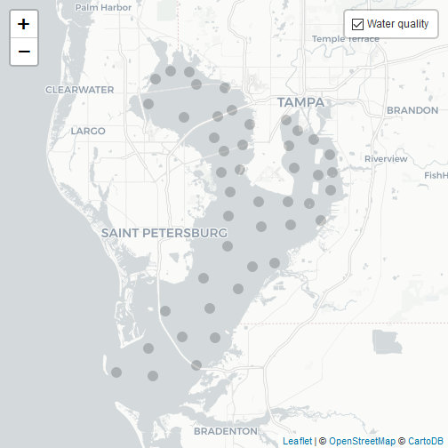
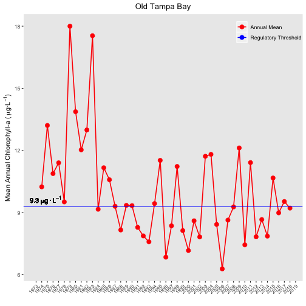
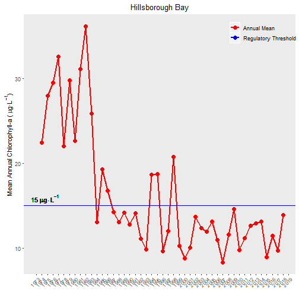
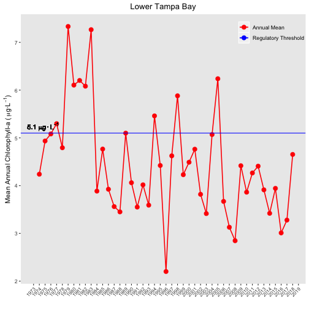
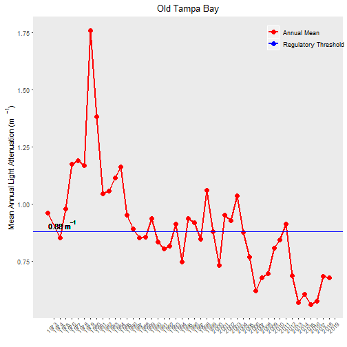
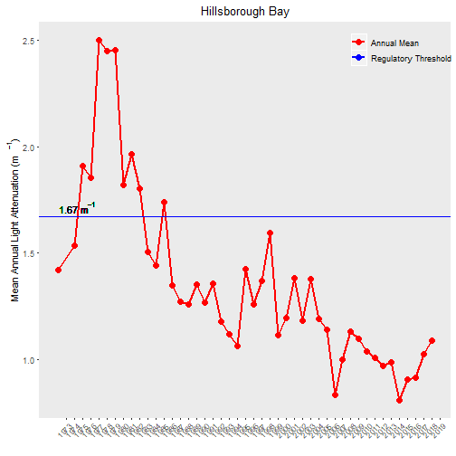
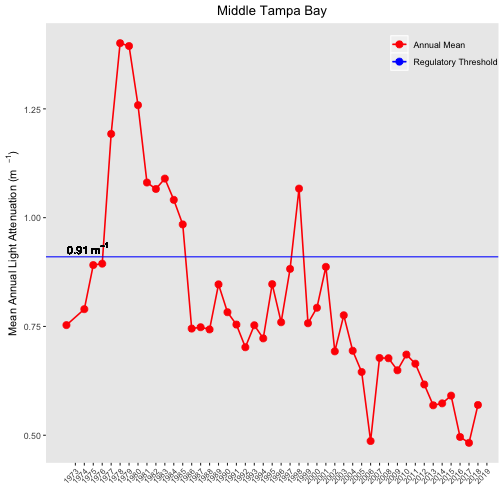
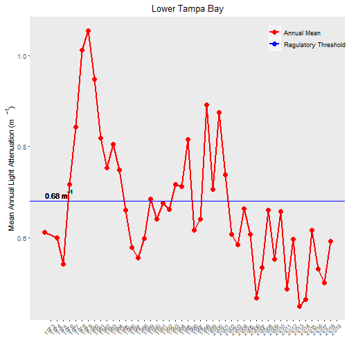

Original: [esherwoo77/pull_epc_data:pull_epc_data.Rmd](https://github.com/esherwoo77/pull_epc_data/blob/master/pull_epc_data.Rmd)


```r
knitr::opts_chunk$set(echo = TRUE, message = F, warning = F)

# libraries
library(tidyverse)
library(leaflet)
library(here)
library(gt)
library(tbeptools)
# devtools::load_all('../tbeptools/.')

# local file path
xlsx <- here('data-raw', '2018_Results_Updated.xls')
```

## Download and import EPCHC dataset


```r
# load data and some light formatting
epcdata <- read_importwq(xlsx, download_latest_epchc = T)
```

```
## File is current...
```

```r
epcdata
```

```
## # A tibble: 25,441 x 11
##    bay_segment epchc_station SampleTime             yr    mo Latitude
##    <chr>               <dbl> <dttm>              <dbl> <dbl>    <dbl>
##  1 HB                      6 2019-04-10 10:26:00  2019     4     27.9
##  2 HB                      7 2019-04-10 10:39:00  2019     4     27.9
##  3 HB                      8 2019-04-10 13:15:00  2019     4     27.9
##  4 MTB                     9 2019-04-10 12:24:00  2019     4     27.8
##  5 MTB                    11 2019-04-10 10:54:00  2019     4     27.8
##  6 MTB                    13 2019-04-10 11:10:00  2019     4     27.8
##  7 MTB                    14 2019-04-10 11:54:00  2019     4     27.8
##  8 MTB                    16 2019-04-17 10:23:00  2019     4     27.7
##  9 MTB                    19 2019-04-17 10:36:00  2019     4     27.7
## 10 LTB                    23 2019-04-17 13:35:00  2019     4     27.7
## # ... with 25,431 more rows, and 5 more variables: Longitude <dbl>,
## #   Total_Depth_m <dbl>, Sample_Depth_m <dbl>, sd_m <dbl>, chla <dbl>
```


```r
#Display station locations
wqsites <- epcdata %>% 
           select(epchc_station, Latitude, Longitude) %>% 
           unique()                                                   

map <- leaflet(wqsites) %>%                                         
              addProviderTiles(providers$CartoDB.Positron) %>% 
              addCircleMarkers(~Longitude, ~Latitude,
                               radius = 6,
                               color = 'black',
                               stroke = FALSE,
                               opacity = 0.8,
                               popup = ~as.character(paste('EPC Station:', epchc_station)), 
                               group = 'Water quality') %>% 
              addLayersControl(overlayGroups = c('Water quality'),
                               options = layersControlOptions(collapsed = FALSE))
map
```



## Plot Mean Annual Chl-a Values by Bay Segment {.tabset}

### Old Tampa Bay


```r
show_thrplot(epcdata, bay_segment = "OTB", thr = "chla")
```



### Hillsborough Bay


```r
show_thrplot(epcdata, bay_segment = "HB", thr = "chla")
```



### Middle Tampa Bay


```r
show_thrplot(epcdata, bay_segment = "MTB", thr = "chla")
```


### Lower Tampa Bay


```r
show_thrplot(epcdata, bay_segment = "LTB", thr = "chla")
```



## Plot Mean Annual Light Attenuation Values by Bay Segment {.tabset}

### Old Tampa Bay


```r
show_thrplot(epcdata, bay_segment = "OTB", thr = "la")
```



### Hillsborough Bay


```r
show_thrplot(epcdata, bay_segment = "HB", thr = "la")
```



### Middle Tampa Bay


```r
show_thrplot(epcdata, bay_segment = "MTB", thr = "la")
```



### Lower Tampa Bay


```r
show_thrplot(epcdata, bay_segment = "LTB", thr = "la")
```



#### NEED TO USE THE FILES BELOW TO GENERATE THE COLOR CODED TABLE OF RESULTS

## Export Annual Values as a Tidy CSV File
Export final datasets to csv files in 'data-processed' folder.

```r
# write.csv(chladata, file = "./data-processed/TB_Chla_Annual_Means.csv")
# write.csv(chlamodata, file = "./data-processed/TB_Chla_Monthly_means.csv")
# write.csv(sdmdata, file = "./data-processed/TB_Secchi_Annual_Means.csv")
# write.csv(sdmmodata, file = "./data-processed/TB_Secchi_Monthly_means.csv")
```

## Colorized Table

Now let's produce a color coded table similar to that found in [tbep-tech:data/wq/TBEP_01_19_2018_**Decision_Matrix_Update**.pdf](https://drive.google.com/open?id=1NGq0VzaPv1_uxgoDkprVTAndSuBygSuq)
  


except we'll include the actual values and color code cells along a gradient using the new [**gt**](https://github.com/rstudio/gt) R package.


```r
colorize_fld <- function(gtbl, fld, pal=c("red", "yellow", "green"), digits=1){
  gtbl %>% 
    data_color(
      #columns = vars(fld), 
      columns = fld, 
      colors = scales::col_numeric(
        palette = pal,
        domain =  gtbl[[fld]])) %>% 
    fmt_number(
      #columns = vars(fld),
      columns = fld,
      decimals = 1) 
}

colorize_tbl <- function(gtbl, exclude_cols="Year", pal=c("red", "yellow", "green"), digits=1){
  flds <- setdiff(names(gtbl), exclude_cols)
  for (fld in flds){
    gtbl <- colorize_fld(gtbl, fld, pal, digits)
  }
  gtbl
}

read_csv(here("data-processed/TB_Chla_Annual_Means.csv")) %>% 
  select(-X1) %>% 
  #View()
  spread(bay_segment, mean_chla) %>% 
  rename(Year=yr) %>% #,
  gt() %>% 
  colorize_tbl()
```

<!--html_preserve--><style>html {
  font-family: -apple-system, BlinkMacSystemFont, 'Segoe UI', Roboto, Oxygen, Ubuntu, Cantarell, 'Helvetica Neue', 'Fira Sans', 'Droid Sans', Arial, sans-serif;
}

#cvmtdxdnxo .gt_table {
  display: table;
  border-collapse: collapse;
  margin-left: auto;
  margin-right: auto;
  color: #000000;
  font-size: 16px;
  background-color: #FFFFFF;
  /* table.background.color */
  width: auto;
  /* table.width */
  border-top-style: solid;
  /* table.border.top.style */
  border-top-width: 2px;
  /* table.border.top.width */
  border-top-color: #A8A8A8;
  /* table.border.top.color */
}

#cvmtdxdnxo .gt_heading {
  background-color: #FFFFFF;
  /* heading.background.color */
  border-bottom-color: #FFFFFF;
}

#cvmtdxdnxo .gt_title {
  color: #000000;
  font-size: 125%;
  /* heading.title.font.size */
  padding-top: 4px;
  /* heading.top.padding */
  padding-bottom: 1px;
  border-bottom-color: #FFFFFF;
  border-bottom-width: 0;
}

#cvmtdxdnxo .gt_subtitle {
  color: #000000;
  font-size: 85%;
  /* heading.subtitle.font.size */
  padding-top: 1px;
  padding-bottom: 4px;
  /* heading.bottom.padding */
  border-top-color: #FFFFFF;
  border-top-width: 0;
}

#cvmtdxdnxo .gt_bottom_border {
  border-bottom-style: solid;
  /* heading.border.bottom.style */
  border-bottom-width: 2px;
  /* heading.border.bottom.width */
  border-bottom-color: #A8A8A8;
  /* heading.border.bottom.color */
}

#cvmtdxdnxo .gt_column_spanner {
  border-bottom-style: solid;
  border-bottom-width: 2px;
  border-bottom-color: #A8A8A8;
  padding-top: 4px;
  padding-bottom: 4px;
}

#cvmtdxdnxo .gt_col_heading {
  color: #000000;
  background-color: #FFFFFF;
  /* column_labels.background.color */
  font-size: 16px;
  /* column_labels.font.size */
  font-weight: initial;
  /* column_labels.font.weight */
  vertical-align: middle;
  padding: 10px;
  margin: 10px;
}

#cvmtdxdnxo .gt_sep_right {
  border-right: 5px solid #FFFFFF;
}

#cvmtdxdnxo .gt_group_heading {
  padding: 8px;
  color: #000000;
  background-color: #FFFFFF;
  /* row_group.background.color */
  font-size: 16px;
  /* row_group.font.size */
  font-weight: initial;
  /* row_group.font.weight */
  border-top-style: solid;
  /* row_group.border.top.style */
  border-top-width: 2px;
  /* row_group.border.top.width */
  border-top-color: #A8A8A8;
  /* row_group.border.top.color */
  border-bottom-style: solid;
  /* row_group.border.bottom.style */
  border-bottom-width: 2px;
  /* row_group.border.bottom.width */
  border-bottom-color: #A8A8A8;
  /* row_group.border.bottom.color */
  vertical-align: middle;
}

#cvmtdxdnxo .gt_empty_group_heading {
  padding: 0.5px;
  color: #000000;
  background-color: #FFFFFF;
  /* row_group.background.color */
  font-size: 16px;
  /* row_group.font.size */
  font-weight: initial;
  /* row_group.font.weight */
  border-top-style: solid;
  /* row_group.border.top.style */
  border-top-width: 2px;
  /* row_group.border.top.width */
  border-top-color: #A8A8A8;
  /* row_group.border.top.color */
  border-bottom-style: solid;
  /* row_group.border.bottom.style */
  border-bottom-width: 2px;
  /* row_group.border.bottom.width */
  border-bottom-color: #A8A8A8;
  /* row_group.border.bottom.color */
  vertical-align: middle;
}

#cvmtdxdnxo .gt_striped {
  background-color: #f2f2f2;
}

#cvmtdxdnxo .gt_from_md > :first-child {
  margin-top: 0;
}

#cvmtdxdnxo .gt_from_md > :last-child {
  margin-bottom: 0;
}

#cvmtdxdnxo .gt_row {
  padding: 8px;
  /* row.padding */
  margin: 10px;
  vertical-align: middle;
}

#cvmtdxdnxo .gt_stub {
  border-right-style: solid;
  border-right-width: 2px;
  border-right-color: #A8A8A8;
  padding-left: 12px;
}

#cvmtdxdnxo .gt_summary_row {
  color: #000000;
  background-color: #FFFFFF;
  /* summary_row.background.color */
  padding: 8px;
  /* summary_row.padding */
  text-transform: inherit;
  /* summary_row.text_transform */
}

#cvmtdxdnxo .gt_grand_summary_row {
  color: #000000;
  background-color: #FFFFFF;
  /* grand_summary_row.background.color */
  padding: 8px;
  /* grand_summary_row.padding */
  text-transform: inherit;
  /* grand_summary_row.text_transform */
}

#cvmtdxdnxo .gt_first_summary_row {
  border-top-style: solid;
  border-top-width: 2px;
  border-top-color: #A8A8A8;
}

#cvmtdxdnxo .gt_first_grand_summary_row {
  border-top-style: double;
  border-top-width: 6px;
  border-top-color: #A8A8A8;
}

#cvmtdxdnxo .gt_table_body {
  border-top-style: solid;
  /* table_body.border.top.style */
  border-top-width: 2px;
  /* table_body.border.top.width */
  border-top-color: #A8A8A8;
  /* table_body.border.top.color */
  border-bottom-style: solid;
  /* table_body.border.bottom.style */
  border-bottom-width: 2px;
  /* table_body.border.bottom.width */
  border-bottom-color: #A8A8A8;
  /* table_body.border.bottom.color */
}

#cvmtdxdnxo .gt_footnote {
  font-size: 90%;
  /* footnote.font.size */
  padding: 4px;
  /* footnote.padding */
}

#cvmtdxdnxo .gt_sourcenote {
  font-size: 90%;
  /* sourcenote.font.size */
  padding: 4px;
  /* sourcenote.padding */
}

#cvmtdxdnxo .gt_center {
  text-align: center;
}

#cvmtdxdnxo .gt_left {
  text-align: left;
}

#cvmtdxdnxo .gt_right {
  text-align: right;
  font-variant-numeric: tabular-nums;
}

#cvmtdxdnxo .gt_font_normal {
  font-weight: normal;
}

#cvmtdxdnxo .gt_font_bold {
  font-weight: bold;
}

#cvmtdxdnxo .gt_font_italic {
  font-style: italic;
}

#cvmtdxdnxo .gt_super {
  font-size: 65%;
}

#cvmtdxdnxo .gt_footnote_glyph {
  font-style: italic;
  font-size: 65%;
}
</style>
<div id="cvmtdxdnxo" style="overflow-x:auto;"><!--gt table start-->
<table class='gt_table'>
<tr>
<th class='gt_col_heading gt_right' rowspan='1' colspan='1'>Year</th>
<th class='gt_col_heading gt_right' rowspan='1' colspan='1'>HB</th>
<th class='gt_col_heading gt_right' rowspan='1' colspan='1'>LTB</th>
<th class='gt_col_heading gt_right' rowspan='1' colspan='1'>MTB</th>
<th class='gt_col_heading gt_right' rowspan='1' colspan='1'>OTB</th>
</tr>
<tbody class='gt_table_body'>
<tr>
<td class='gt_row gt_right'>1974</td>
<td class='gt_row gt_right' style="background-color:#F8FF00;color:#000000FF;">22.4</td>
<td class='gt_row gt_right' style="background-color:#FFDA00;color:#000000FF;">4.2</td>
<td class='gt_row gt_right' style="background-color:#FFD800;color:#000000FF;">9.7</td>
<td class='gt_row gt_right' style="background-color:#FFE100;color:#000000FF;">10.2</td>
</tr>
<tr>
<td class='gt_row gt_right gt_striped'>1975</td>
<td class='gt_row gt_right gt_striped' style="background-color:#BAFF00;color:#000000FF;">27.9</td>
<td class='gt_row gt_right gt_striped' style="background-color:#F5FF00;color:#000000FF;">4.9</td>
<td class='gt_row gt_right gt_striped' style="background-color:#FEFF00;color:#000000FF;">11.4</td>
<td class='gt_row gt_right gt_striped' style="background-color:#D4FF00;color:#000000FF;">13.2</td>
</tr>
<tr>
<td class='gt_row gt_right'>1976</td>
<td class='gt_row gt_right' style="background-color:#A7FF00;color:#000000FF;">29.5</td>
<td class='gt_row gt_right' style="background-color:#ECFF00;color:#000000FF;">5.1</td>
<td class='gt_row gt_right' style="background-color:#FFDF00;color:#000000FF;">10.0</td>
<td class='gt_row gt_right' style="background-color:#FFF200;color:#000000FF;">10.9</td>
</tr>
<tr>
<td class='gt_row gt_right gt_striped'>1977</td>
<td class='gt_row gt_right gt_striped' style="background-color:#79FF00;color:#000000FF;">32.5</td>
<td class='gt_row gt_right gt_striped' style="background-color:#DFFF00;color:#000000FF;">5.3</td>
<td class='gt_row gt_right gt_striped' style="background-color:#DEFF00;color:#000000FF;">13.1</td>
<td class='gt_row gt_right gt_striped' style="background-color:#FEFF00;color:#000000FF;">11.4</td>
</tr>
<tr>
<td class='gt_row gt_right'>1978</td>
<td class='gt_row gt_right' style="background-color:#FCFF00;color:#000000FF;">22.0</td>
<td class='gt_row gt_right' style="background-color:#FDFF00;color:#000000FF;">4.8</td>
<td class='gt_row gt_right' style="background-color:#FFFD00;color:#000000FF;">11.3</td>
<td class='gt_row gt_right' style="background-color:#FFCD00;color:#000000FF;">9.5</td>
</tr>
<tr>
<td class='gt_row gt_right gt_striped'>1979</td>
<td class='gt_row gt_right gt_striped' style="background-color:#A3FF00;color:#000000FF;">29.7</td>
<td class='gt_row gt_right gt_striped' style="background-color:#00FF00;color:#000000FF;">7.3</td>
<td class='gt_row gt_right gt_striped' style="background-color:#6FFF00;color:#000000FF;">17.7</td>
<td class='gt_row gt_right gt_striped' style="background-color:#00FF00;color:#000000FF;">18.0</td>
</tr>
<tr>
<td class='gt_row gt_right'>1980</td>
<td class='gt_row gt_right' style="background-color:#F6FF00;color:#000000FF;">22.6</td>
<td class='gt_row gt_right' style="background-color:#AAFF00;color:#000000FF;">6.1</td>
<td class='gt_row gt_right' style="background-color:#BDFF00;color:#000000FF;">14.7</td>
<td class='gt_row gt_right' style="background-color:#C3FF00;color:#000000FF;">13.9</td>
</tr>
<tr>
<td class='gt_row gt_right gt_striped'>1981</td>
<td class='gt_row gt_right gt_striped' style="background-color:#90FF00;color:#000000FF;">31.1</td>
<td class='gt_row gt_right gt_striped' style="background-color:#A3FF00;color:#000000FF;">6.2</td>
<td class='gt_row gt_right gt_striped' style="background-color:#D3FF00;color:#000000FF;">13.6</td>
<td class='gt_row gt_right gt_striped' style="background-color:#F0FF00;color:#000000FF;">12.0</td>
</tr>
<tr>
<td class='gt_row gt_right'>1982</td>
<td class='gt_row gt_right' style="background-color:#00FF00;color:#000000FF;">36.1</td>
<td class='gt_row gt_right' style="background-color:#ABFF00;color:#000000FF;">6.1</td>
<td class='gt_row gt_right' style="background-color:#3FFF00;color:#000000FF;">18.8</td>
<td class='gt_row gt_right' style="background-color:#D9FF00;color:#000000FF;">13.0</td>
</tr>
<tr>
<td class='gt_row gt_right gt_striped'>1983</td>
<td class='gt_row gt_right gt_striped' style="background-color:#D2FF00;color:#000000FF;">25.9</td>
<td class='gt_row gt_right gt_striped' style="background-color:#25FF00;color:#000000FF;">7.3</td>
<td class='gt_row gt_right gt_striped' style="background-color:#00FF00;color:#000000FF;">19.3</td>
<td class='gt_row gt_right gt_striped' style="background-color:#3FFF00;color:#000000FF;">17.5</td>
</tr>
<tr>
<td class='gt_row gt_right'>1984</td>
<td class='gt_row gt_right' style="background-color:#FF8C00;color:#000000FF;">13.1</td>
<td class='gt_row gt_right' style="background-color:#FFC000;color:#000000FF;">3.9</td>
<td class='gt_row gt_right' style="background-color:#FFC400;color:#000000FF;">8.8</td>
<td class='gt_row gt_right' style="background-color:#FFC300;color:#000000FF;">9.2</td>
</tr>
<tr>
<td class='gt_row gt_right gt_striped'>1985</td>
<td class='gt_row gt_right gt_striped' style="background-color:#FFE000;color:#000000FF;">19.3</td>
<td class='gt_row gt_right gt_striped' style="background-color:#FFFF00;color:#000000FF;">4.8</td>
<td class='gt_row gt_right gt_striped' style="background-color:#E0FF00;color:#000000FF;">13.0</td>
<td class='gt_row gt_right gt_striped' style="background-color:#FFFA00;color:#000000FF;">11.2</td>
</tr>
<tr>
<td class='gt_row gt_right'>1986</td>
<td class='gt_row gt_right' style="background-color:#FFC000;color:#000000FF;">16.8</td>
<td class='gt_row gt_right' style="background-color:#FFC300;color:#000000FF;">3.9</td>
<td class='gt_row gt_right' style="background-color:#FFB600;color:#000000FF;">8.2</td>
<td class='gt_row gt_right' style="background-color:#FFEA00;color:#000000FF;">10.6</td>
</tr>
<tr>
<td class='gt_row gt_right gt_striped'>1987</td>
<td class='gt_row gt_right gt_striped' style="background-color:#FF9D00;color:#000000FF;">14.2</td>
<td class='gt_row gt_right gt_striped' style="background-color:#FFA800;color:#000000FF;">3.6</td>
<td class='gt_row gt_right gt_striped' style="background-color:#FFBE00;color:#000000FF;">8.6</td>
<td class='gt_row gt_right gt_striped' style="background-color:#FFC700;color:#000000FF;">9.3</td>
</tr>
<tr>
<td class='gt_row gt_right'>1988</td>
<td class='gt_row gt_right' style="background-color:#FF8C00;color:#000000FF;">13.0</td>
<td class='gt_row gt_right' style="background-color:#FF9F00;color:#000000FF;">3.4</td>
<td class='gt_row gt_right' style="background-color:#FFA800;color:#000000FF;">7.7</td>
<td class='gt_row gt_right' style="background-color:#FFA600;color:#000000FF;">8.2</td>
</tr>
<tr>
<td class='gt_row gt_right gt_striped'>1989</td>
<td class='gt_row gt_right gt_striped' style="background-color:#FF9D00;color:#000000FF;">14.2</td>
<td class='gt_row gt_right gt_striped' style="background-color:#EBFF00;color:#000000FF;">5.1</td>
<td class='gt_row gt_right gt_striped' style="background-color:#FFBA00;color:#000000FF;">8.4</td>
<td class='gt_row gt_right gt_striped' style="background-color:#FFC800;color:#000000FF;">9.3</td>
</tr>
<tr>
<td class='gt_row gt_right'>1990</td>
<td class='gt_row gt_right' style="background-color:#FF8900;color:#000000FF;">12.8</td>
<td class='gt_row gt_right' style="background-color:#FFCD00;color:#000000FF;">4.1</td>
<td class='gt_row gt_right' style="background-color:#FFB900;color:#000000FF;">8.4</td>
<td class='gt_row gt_right' style="background-color:#FFC800;color:#000000FF;">9.3</td>
</tr>
<tr>
<td class='gt_row gt_right gt_striped'>1991</td>
<td class='gt_row gt_right gt_striped' style="background-color:#FF9B00;color:#000000FF;">14.1</td>
<td class='gt_row gt_right gt_striped' style="background-color:#FFA700;color:#000000FF;">3.6</td>
<td class='gt_row gt_right gt_striped' style="background-color:#FFAE00;color:#000000FF;">7.9</td>
<td class='gt_row gt_right gt_striped' style="background-color:#FFA900;color:#000000FF;">8.3</td>
</tr>
<tr>
<td class='gt_row gt_right'>1992</td>
<td class='gt_row gt_right' style="background-color:#FF6E00;color:#000000FF;">11.1</td>
<td class='gt_row gt_right' style="background-color:#FFC900;color:#000000FF;">4.0</td>
<td class='gt_row gt_right' style="background-color:#FF8A00;color:#000000FF;">6.5</td>
<td class='gt_row gt_right' style="background-color:#FF9D00;color:#000000FF;">7.9</td>
</tr>
<tr>
<td class='gt_row gt_right gt_striped'>1993</td>
<td class='gt_row gt_right gt_striped' style="background-color:#FF5800;color:#FFFFFFFF;">9.8</td>
<td class='gt_row gt_right gt_striped' style="background-color:#FFAA00;color:#000000FF;">3.6</td>
<td class='gt_row gt_right gt_striped' style="background-color:#FF8D00;color:#000000FF;">6.6</td>
<td class='gt_row gt_right gt_striped' style="background-color:#FF9400;color:#000000FF;">7.6</td>
</tr>
<tr>
<td class='gt_row gt_right'>1994</td>
<td class='gt_row gt_right' style="background-color:#FFD800;color:#000000FF;">18.7</td>
<td class='gt_row gt_right' style="background-color:#D5FF00;color:#000000FF;">5.5</td>
<td class='gt_row gt_right' style="background-color:#FFF700;color:#000000FF;">11.0</td>
<td class='gt_row gt_right' style="background-color:#FFCA00;color:#000000FF;">9.4</td>
</tr>
<tr>
<td class='gt_row gt_right gt_striped'>1995</td>
<td class='gt_row gt_right gt_striped' style="background-color:#FFD900;color:#000000FF;">18.7</td>
<td class='gt_row gt_right gt_striped' style="background-color:#FFE700;color:#000000FF;">4.4</td>
<td class='gt_row gt_right gt_striped' style="background-color:#FFE600;color:#000000FF;">10.3</td>
<td class='gt_row gt_right gt_striped' style="background-color:#FBFF00;color:#000000FF;">11.5</td>
</tr>
<tr>
<td class='gt_row gt_right'>1996</td>
<td class='gt_row gt_right' style="background-color:#FF5400;color:#FFFFFFFF;">9.6</td>
<td class='gt_row gt_right' style="background-color:#FF0000;color:#FFFFFFFF;">2.2</td>
<td class='gt_row gt_right' style="background-color:#FF6A00;color:#000000FF;">5.3</td>
<td class='gt_row gt_right' style="background-color:#FF7D00;color:#000000FF;">6.8</td>
</tr>
<tr>
<td class='gt_row gt_right gt_striped'>1997</td>
<td class='gt_row gt_right gt_striped' style="background-color:#FF7D00;color:#000000FF;">12.0</td>
<td class='gt_row gt_right gt_striped' style="background-color:#FFF500;color:#000000FF;">4.6</td>
<td class='gt_row gt_right gt_striped' style="background-color:#FFB000;color:#000000FF;">8.0</td>
<td class='gt_row gt_right gt_striped' style="background-color:#FFAC00;color:#000000FF;">8.4</td>
</tr>
<tr>
<td class='gt_row gt_right'>1998</td>
<td class='gt_row gt_right' style="background-color:#FFF300;color:#000000FF;">20.7</td>
<td class='gt_row gt_right' style="background-color:#BAFF00;color:#000000FF;">5.9</td>
<td class='gt_row gt_right' style="background-color:#EFFF00;color:#000000FF;">12.2</td>
<td class='gt_row gt_right' style="background-color:#FFFC00;color:#000000FF;">11.2</td>
</tr>
<tr>
<td class='gt_row gt_right gt_striped'>1999</td>
<td class='gt_row gt_right gt_striped' style="background-color:#FF6000;color:#000000FF;">10.3</td>
<td class='gt_row gt_right gt_striped' style="background-color:#FFD900;color:#000000FF;">4.2</td>
<td class='gt_row gt_right gt_striped' style="background-color:#FF9D00;color:#000000FF;">7.2</td>
<td class='gt_row gt_right gt_striped' style="background-color:#FFA500;color:#000000FF;">8.1</td>
</tr>
<tr>
<td class='gt_row gt_right'>2000</td>
<td class='gt_row gt_right' style="background-color:#FF4200;color:#FFFFFFFF;">8.8</td>
<td class='gt_row gt_right' style="background-color:#FFEB00;color:#000000FF;">4.5</td>
<td class='gt_row gt_right' style="background-color:#FF7F00;color:#000000FF;">6.1</td>
<td class='gt_row gt_right' style="background-color:#FF8700;color:#000000FF;">7.2</td>
</tr>
<tr>
<td class='gt_row gt_right gt_striped'>2001</td>
<td class='gt_row gt_right gt_striped' style="background-color:#FF5D00;color:#000000FF;">10.1</td>
<td class='gt_row gt_right gt_striped' style="background-color:#FFFF00;color:#000000FF;">4.8</td>
<td class='gt_row gt_right gt_striped' style="background-color:#FFAA00;color:#000000FF;">7.7</td>
<td class='gt_row gt_right gt_striped' style="background-color:#FFB300;color:#000000FF;">8.6</td>
</tr>
<tr>
<td class='gt_row gt_right'>2002</td>
<td class='gt_row gt_right' style="background-color:#FF9600;color:#000000FF;">13.7</td>
<td class='gt_row gt_right' style="background-color:#FFBB00;color:#000000FF;">3.8</td>
<td class='gt_row gt_right' style="background-color:#FF8100;color:#000000FF;">6.1</td>
<td class='gt_row gt_right' style="background-color:#FF9C00;color:#000000FF;">7.8</td>
</tr>
<tr>
<td class='gt_row gt_right gt_striped'>2003</td>
<td class='gt_row gt_right gt_striped' style="background-color:#FF8300;color:#000000FF;">12.4</td>
<td class='gt_row gt_right gt_striped' style="background-color:#FF9C00;color:#000000FF;">3.4</td>
<td class='gt_row gt_right gt_striped' style="background-color:#FFAB00;color:#000000FF;">7.8</td>
<td class='gt_row gt_right gt_striped' style="background-color:#F7FF00;color:#000000FF;">11.7</td>
</tr>
<tr>
<td class='gt_row gt_right'>2004</td>
<td class='gt_row gt_right' style="background-color:#FF7C00;color:#000000FF;">11.9</td>
<td class='gt_row gt_right' style="background-color:#EDFF00;color:#000000FF;">5.1</td>
<td class='gt_row gt_right' style="background-color:#FF8E00;color:#000000FF;">6.6</td>
<td class='gt_row gt_right' style="background-color:#F5FF00;color:#000000FF;">11.8</td>
</tr>
<tr>
<td class='gt_row gt_right gt_striped'>2005</td>
<td class='gt_row gt_right gt_striped' style="background-color:#FF8D00;color:#000000FF;">13.1</td>
<td class='gt_row gt_right gt_striped' style="background-color:#A0FF00;color:#000000FF;">6.2</td>
<td class='gt_row gt_right gt_striped' style="background-color:#FFA800;color:#000000FF;">7.6</td>
<td class='gt_row gt_right gt_striped' style="background-color:#FFAE00;color:#000000FF;">8.4</td>
</tr>
<tr>
<td class='gt_row gt_right'>2006</td>
<td class='gt_row gt_right' style="background-color:#FF6C00;color:#000000FF;">10.9</td>
<td class='gt_row gt_right' style="background-color:#FFB000;color:#000000FF;">3.7</td>
<td class='gt_row gt_right' style="background-color:#FF6300;color:#000000FF;">5.1</td>
<td class='gt_row gt_right' style="background-color:#FF6900;color:#000000FF;">6.3</td>
</tr>
<tr>
<td class='gt_row gt_right gt_striped'>2007</td>
<td class='gt_row gt_right gt_striped' style="background-color:#FF3500;color:#FFFFFFFF;">8.3</td>
<td class='gt_row gt_right gt_striped' style="background-color:#FF8500;color:#000000FF;">3.1</td>
<td class='gt_row gt_right gt_striped' style="background-color:#FF7000;color:#000000FF;">5.5</td>
<td class='gt_row gt_right gt_striped' style="background-color:#FFB400;color:#000000FF;">8.6</td>
</tr>
<tr>
<td class='gt_row gt_right'>2008</td>
<td class='gt_row gt_right' style="background-color:#FF7600;color:#000000FF;">11.6</td>
<td class='gt_row gt_right' style="background-color:#FF6C00;color:#000000FF;">2.8</td>
<td class='gt_row gt_right' style="background-color:#FF7600;color:#000000FF;">5.7</td>
<td class='gt_row gt_right' style="background-color:#FFC600;color:#000000FF;">9.3</td>
</tr>
<tr>
<td class='gt_row gt_right gt_striped'>2009</td>
<td class='gt_row gt_right gt_striped' style="background-color:#FFA300;color:#000000FF;">14.6</td>
<td class='gt_row gt_right gt_striped' style="background-color:#FFE600;color:#000000FF;">4.4</td>
<td class='gt_row gt_right gt_striped' style="background-color:#FF8A00;color:#000000FF;">6.5</td>
<td class='gt_row gt_right gt_striped' style="background-color:#EDFF00;color:#000000FF;">12.1</td>
</tr>
<tr>
<td class='gt_row gt_right'>2010</td>
<td class='gt_row gt_right' style="background-color:#FF5700;color:#FFFFFFFF;">9.8</td>
<td class='gt_row gt_right' style="background-color:#FFBE00;color:#000000FF;">3.9</td>
<td class='gt_row gt_right' style="background-color:#FF7F00;color:#000000FF;">6.1</td>
<td class='gt_row gt_right' style="background-color:#FF9000;color:#000000FF;">7.4</td>
</tr>
<tr>
<td class='gt_row gt_right gt_striped'>2011</td>
<td class='gt_row gt_right gt_striped' style="background-color:#FF7000;color:#000000FF;">11.2</td>
<td class='gt_row gt_right gt_striped' style="background-color:#FFDB00;color:#000000FF;">4.3</td>
<td class='gt_row gt_right gt_striped' style="background-color:#FFB200;color:#000000FF;">8.0</td>
<td class='gt_row gt_right gt_striped' style="background-color:#FEFF00;color:#000000FF;">11.4</td>
</tr>
<tr>
<td class='gt_row gt_right'>2012</td>
<td class='gt_row gt_right' style="background-color:#FF8600;color:#000000FF;">12.6</td>
<td class='gt_row gt_right' style="background-color:#FFE600;color:#000000FF;">4.4</td>
<td class='gt_row gt_right' style="background-color:#FFAD00;color:#000000FF;">7.8</td>
<td class='gt_row gt_right' style="background-color:#FF9C00;color:#000000FF;">7.8</td>
</tr>
<tr>
<td class='gt_row gt_right gt_striped'>2013</td>
<td class='gt_row gt_right gt_striped' style="background-color:#FF8B00;color:#000000FF;">12.9</td>
<td class='gt_row gt_right gt_striped' style="background-color:#FFC200;color:#000000FF;">3.9</td>
<td class='gt_row gt_right gt_striped' style="background-color:#FF9400;color:#000000FF;">6.8</td>
<td class='gt_row gt_right gt_striped' style="background-color:#FFB400;color:#000000FF;">8.7</td>
</tr>
<tr>
<td class='gt_row gt_right'>2014</td>
<td class='gt_row gt_right' style="background-color:#FF8E00;color:#000000FF;">13.1</td>
<td class='gt_row gt_right' style="background-color:#FF9D00;color:#000000FF;">3.4</td>
<td class='gt_row gt_right' style="background-color:#FF9300;color:#000000FF;">6.8</td>
<td class='gt_row gt_right' style="background-color:#FF9D00;color:#000000FF;">7.9</td>
</tr>
<tr>
<td class='gt_row gt_right gt_striped'>2015</td>
<td class='gt_row gt_right gt_striped' style="background-color:#FF4500;color:#FFFFFFFF;">9.0</td>
<td class='gt_row gt_right gt_striped' style="background-color:#FFC400;color:#000000FF;">3.9</td>
<td class='gt_row gt_right gt_striped' style="background-color:#FFB200;color:#000000FF;">8.1</td>
<td class='gt_row gt_right gt_striped' style="background-color:#FFED00;color:#000000FF;">10.7</td>
</tr>
<tr>
<td class='gt_row gt_right'>2016</td>
<td class='gt_row gt_right' style="background-color:#FF7400;color:#000000FF;">11.4</td>
<td class='gt_row gt_right' style="background-color:#FF7B00;color:#000000FF;">3.0</td>
<td class='gt_row gt_right' style="background-color:#FF7400;color:#000000FF;">5.7</td>
<td class='gt_row gt_right' style="background-color:#FFBE00;color:#000000FF;">9.0</td>
</tr>
<tr>
<td class='gt_row gt_right gt_striped'>2017</td>
<td class='gt_row gt_right gt_striped' style="background-color:#FF5500;color:#FFFFFFFF;">9.7</td>
<td class='gt_row gt_right gt_striped' style="background-color:#FF9100;color:#000000FF;">3.3</td>
<td class='gt_row gt_right gt_striped' style="background-color:#FF7700;color:#000000FF;">5.8</td>
<td class='gt_row gt_right gt_striped' style="background-color:#FFCD00;color:#000000FF;">9.5</td>
</tr>
<tr>
<td class='gt_row gt_right'>2018</td>
<td class='gt_row gt_right' style="background-color:#FF9800;color:#000000FF;">13.9</td>
<td class='gt_row gt_right' style="background-color:#FFF700;color:#000000FF;">4.7</td>
<td class='gt_row gt_right' style="background-color:#FF9900;color:#000000FF;">7.0</td>
<td class='gt_row gt_right' style="background-color:#FFC400;color:#000000FF;">9.2</td>
</tr>
<tr>
<td class='gt_row gt_right gt_striped'>2019</td>
<td class='gt_row gt_right gt_striped' style="background-color:#FF0000;color:#FFFFFFFF;">7.4</td>
<td class='gt_row gt_right gt_striped' style="background-color:#FF5800;color:#FFFFFFFF;">2.6</td>
<td class='gt_row gt_right gt_striped' style="background-color:#FF0000;color:#FFFFFFFF;">3.4</td>
<td class='gt_row gt_right gt_striped' style="background-color:#FF0000;color:#FFFFFFFF;">4.7</td>
</tr>
</tbody>
</table>
<!--gt table end-->
</div><!--/html_preserve-->
